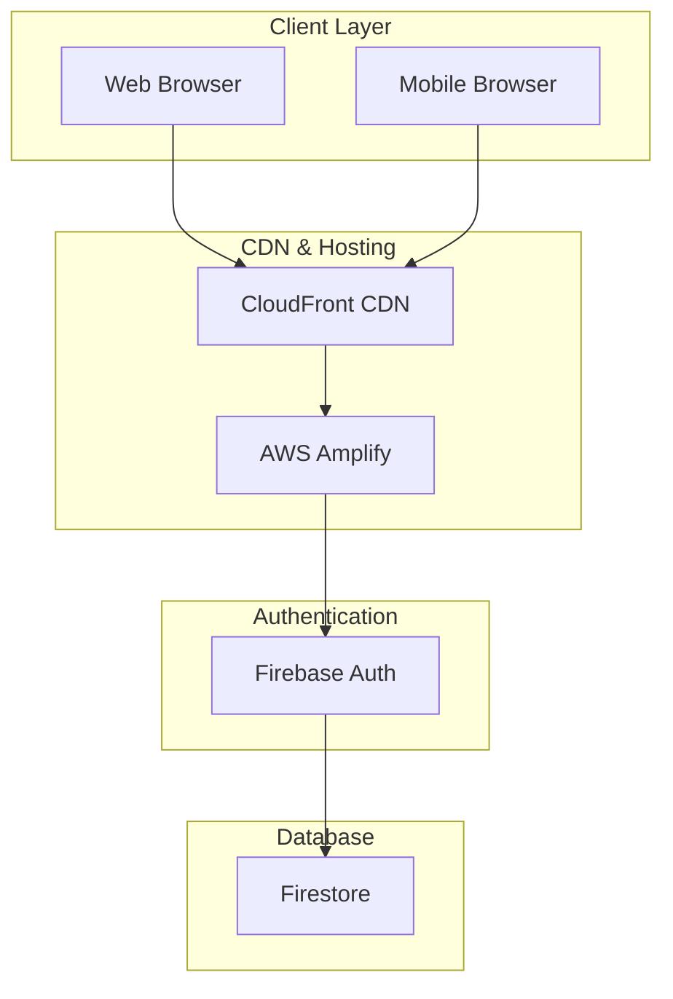
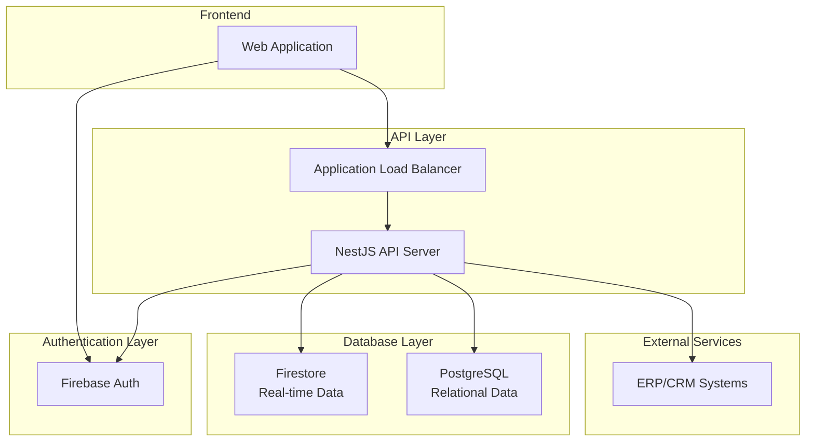
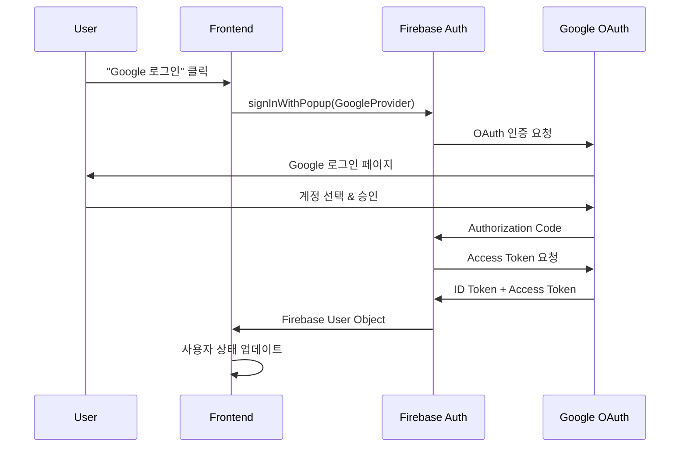
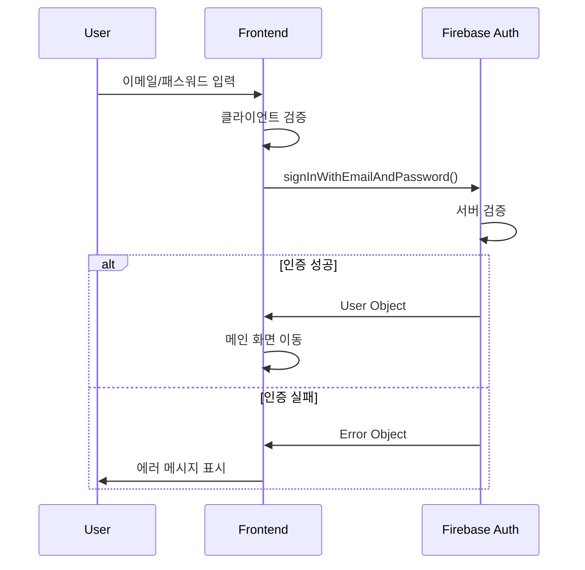
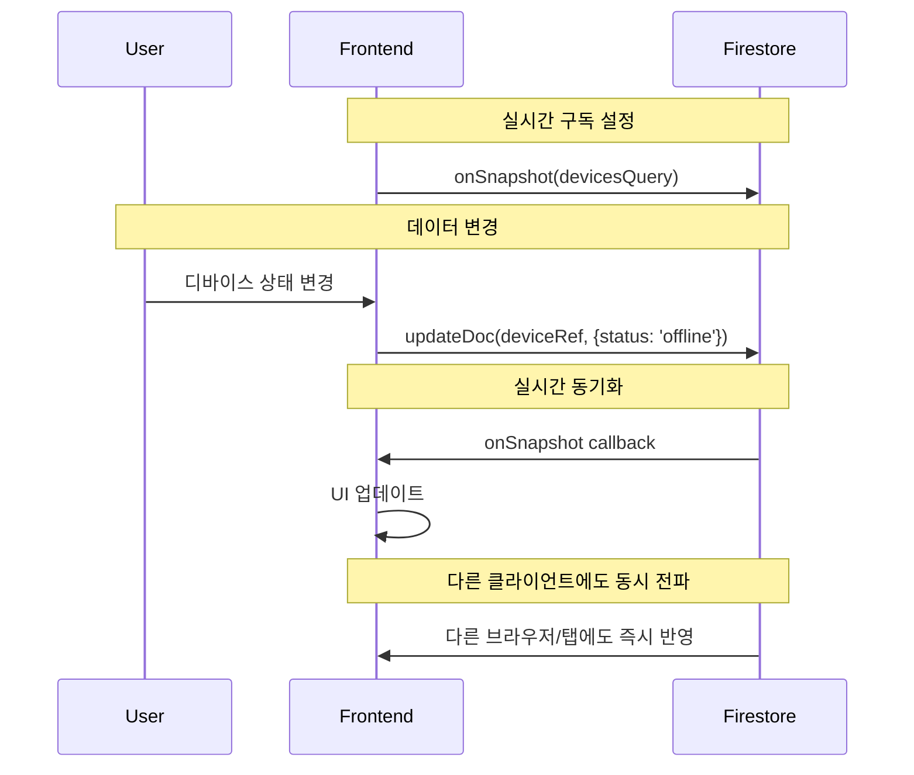

# 🏗️ 서비스 플랫폼 설계서

## 📋 **설계 개요**

### **시스템 목표**
- **서비스명**: AIoT Device Manager
- **아키텍처**: Serverless-First with Progressive Enhancement
- **핵심 철학**: "빠른 배포 → 점진적 확장"

### **설계 원칙**
1. **단순성 우선**: 복잡성보다 명확성 추구
2. **확장 가능성**: 미래 요구사항 대응 가능한 구조
3. **비용 효율성**: 사용량 기반 과금 모델 활용
4. **보안 내재화**: 설계 단계부터 보안 고려

---

## 🏛️ **1. 인프라 구조 설계**

### **Phase 1: Serverless MVP 아키텍처**



#### **인프라 구성 요소**

| 계층 | 기술 | 역할 | 확장성 |
|------|------|------|--------|
| **CDN** | CloudFront | 전 세계 콘텐츠 전송 | Auto-scaling |
| **Hosting** | AWS Amplify | 정적 파일 호스팅 | Auto-deployment |
| **Authentication** | Firebase Auth | 사용자 인증 관리 | Multi-region |
| **Database** | Firestore | 실시간 데이터 저장 | Auto-scaling |

#### **리전 배치 전략**
```yaml
Primary Region: ap-northeast-2 (Seoul)
Secondary Region: us-east-1 (N. Virginia)
CDN Edge Locations: Global (180+ locations)

Disaster Recovery:
  - Firestore: Multi-region replication
  - Amplify: Cross-region backup
  - DNS: Route 53 health checks
```

### **Phase 2: 하이브리드 확장 아키텍처**



---

## 🔐 **2. 로그인 인증 설계**

### **인증 플로우 설계**

#### **2.1 Google OAuth 인증 플로우**


#### **2.2 이메일/패스워드 인증 플로우**


### **인증 보안 설계**

#### **2.3 토큰 관리 전략**
```javascript
// Firebase Auth 토큰 자동 관리
const authState = {
  user: null,
  idToken: null,
  refreshToken: null,
  expiresAt: null
};

// 토큰 자동 갱신
firebase.auth().onIdTokenChanged(async (user) => {
  if (user) {
    const token = await user.getIdToken();
    authState.idToken = token;
    // API 호출 시 Authorization 헤더에 포함
  }
});
```

#### **2.4 권한 기반 접근 제어**
```javascript
// Firestore Security Rules
rules_version = '2';
service cloud.firestore {
  match /databases/{database}/documents {
    // 사용자별 디바이스 격리
    match /devices/{deviceId} {
      allow read, write: if request.auth != null 
        && request.auth.uid == resource.data.userId;
    }
    
    // 사용자 프로필 접근
    match /users/{userId} {
      allow read, write: if request.auth != null 
        && request.auth.uid == userId;
    }
  }
}
```

#### **2.5 세션 관리 설계**
| 요소 | 구현 방식 | 보안 수준 |
|------|-----------|-----------|
| **세션 지속성** | Firebase Local Storage | 🔒 암호화 저장 |
| **토큰 갱신** | 자동 (1시간마다) | 🔒 Background 처리 |
| **로그아웃** | 토큰 무효화 | 🔒 즉시 적용 |
| **다중 세션** | 동일 계정 허용 | 🔒 세션별 토큰 관리 |

---

## 📊 **3. 입출력 구조 설계**

### **3.1 데이터 모델 설계**

#### **Firestore 데이터 구조**
```javascript
// Collection: devices
{
  deviceId: "auto-generated-id",
  userId: "firebase-user-uid",           // 데이터 격리
  name: "거실 온도센서",                  // 사용자 정의 이름
  type: "sensor",                       // enum: sensor|actuator|gateway|camera
  status: "online",                     // enum: online|offline|error
  location: "거실",                      // 설치 위치
  batteryLevel: 85,                     // 0-100 (%)
  lastSeen: Timestamp,                  // 마지막 활동 시간
  createdAt: Timestamp,                 // 등록 시간
  metadata: {                           // 디바이스별 추가 정보
    model: "DHT22",
    serialNumber: "SN123456",
    firmwareVersion: "1.2.3"
  }
}
```

#### **사용자 프로필 구조**
```javascript
// Collection: users (선택적)
{
  uid: "firebase-user-uid",
  email: "user@example.com",
  displayName: "홍길동",
  photoURL: "https://...",
  preferences: {
    language: "ko",
    timezone: "Asia/Seoul",
    notifications: true
  },
  subscription: {
    plan: "free",
    startDate: Timestamp,
    endDate: Timestamp
  }
}
```

### **3.2 API 인터페이스 설계**

#### **RESTful API 엔드포인트**
```yaml
# 디바이스 관리
GET    /api/devices              # 사용자 디바이스 목록
POST   /api/devices              # 새 디바이스 등록
GET    /api/devices/:id          # 특정 디바이스 상세
PUT    /api/devices/:id          # 디바이스 정보 수정
DELETE /api/devices/:id          # 디바이스 삭제

# 인증 관리  
POST   /api/auth/verify          # Firebase 토큰 검증
POST   /api/auth/refresh         # 토큰 갱신
POST   /api/auth/logout          # 로그아웃

# 통계 및 분석
GET    /api/analytics/dashboard  # 사용자 대시보드
GET    /api/analytics/devices    # 디바이스 통계
```

#### **실시간 데이터 플로우**


### **3.3 데이터 입력 검증**

#### **클라이언트 사이드 검증**
```javascript
// 디바이스 등록 검증
function validateDeviceInput(device) {
  const errors = {};
  
  // 필수 필드 검증
  if (!device.name?.trim()) {
    errors.name = "디바이스 이름은 필수입니다";
  }
  
  // 길이 제한
  if (device.name?.length > 50) {
    errors.name = "디바이스 이름은 50자 이하여야 합니다";
  }
  
  // 타입 검증
  const validTypes = ['sensor', 'actuator', 'gateway', 'camera'];
  if (!validTypes.includes(device.type)) {
    errors.type = "올바른 디바이스 타입을 선택하세요";
  }
  
  // HTML 이스케이핑
  device.name = escapeHtml(device.name);
  device.location = escapeHtml(device.location);
  
  return { isValid: Object.keys(errors).length === 0, errors };
}
```

#### **서버 사이드 검증 (Phase 2)**
```typescript
// NestJS DTO 검증
import { IsString, IsEnum, IsNumber, Min, Max } from 'class-validator';

export class CreateDeviceDto {
  @IsString()
  @Length(1, 50)
  name: string;

  @IsEnum(['sensor', 'actuator', 'gateway', 'camera'])
  type: string;

  @IsString()
  @Length(1, 100)
  location: string;

  @IsNumber()
  @Min(0)
  @Max(100)
  batteryLevel: number;
}
```

### **3.4 출력 형식 설계**

#### **API 응답 형식**
```javascript
// 성공 응답
{
  "success": true,
  "data": {
    "devices": [...],
    "total": 15,
    "page": 1,
    "limit": 10
  },
  "timestamp": "2025-08-15T10:30:00Z"
}

// 에러 응답
{
  "success": false,
  "error": {
    "code": "DEVICE_NOT_FOUND",
    "message": "디바이스를 찾을 수 없습니다",
    "details": {
      "deviceId": "invalid-id"
    }
  },
  "timestamp": "2025-08-15T10:30:00Z"
}
```

#### **실시간 이벤트 형식**
```javascript
// Firestore onSnapshot 이벤트
{
  "type": "device_updated",
  "deviceId": "device123",
  "changes": {
    "status": { "from": "online", "to": "offline" },
    "lastSeen": { "to": "2025-08-15T10:30:00Z" }
  },
  "timestamp": "2025-08-15T10:30:00Z"
}
```

---

## 🔧 **4. 시스템 통합 설계**

### **4.1 모니터링 및 로깅**

#### **성능 모니터링**
```yaml
Metrics:
  - Response Time: < 3초 (95th percentile)
  - Uptime: > 99.9%
  - Error Rate: < 0.1%
  - Concurrent Users: 1,000명

Monitoring Tools:
  - CloudWatch (AWS 인프라)
  - Firebase Analytics (사용자 행동)
  - Lighthouse (성능 점수)
```

#### **에러 추적**
```javascript
// 에러 로깅 전략
const errorLogger = {
  logClientError: (error, context) => {
    console.error('Client Error:', {
      message: error.message,
      stack: error.stack,
      url: window.location.href,
      userAgent: navigator.userAgent,
      userId: auth.currentUser?.uid,
      timestamp: new Date().toISOString(),
      context
    });
  }
};
```

### **4.2 보안 설계**

#### **다층 보안 모델**
```
Layer 1: CDN/WAF (DDoS 방어)
Layer 2: Firebase Auth (인증)
Layer 3: Firestore Rules (인가)
Layer 4: Input Validation (입력 검증)
Layer 5: XSS Protection (출력 검증)
```

#### **데이터 보호**
```javascript
// 개인정보 보호
const dataProtection = {
  encryption: "Firebase 기본 암호화",
  backup: "Multi-region 자동 백업",
  retention: "GDPR 준수 (최대 2년)",
  deletion: "사용자 요청 시 즉시 삭제"
};
```

### **4.3 확장성 설계**

#### **수평 확장 전략**
```yaml
Current Capacity:
  Concurrent Users: 1,000
  Requests per Second: 100
  Data Storage: 1GB

Scale-out Plan:
  Phase 2: +Backend API (10,000 users)
  Phase 3: +Load Balancer (100,000 users)  
  Phase 4: +Microservices (1M+ users)
```

#### **비용 최적화**
```yaml
Cost Structure:
  Firebase: $0-50/month (usage-based)
  Amplify: $0-20/month (build-based)
  Total: $0-70/month

Optimization:
  - Query efficiency tuning
  - Firestore read/write minimization
  - CDN cache optimization
```

---

## 📈 **5. 성능 및 품질 설계**

### **5.1 성능 목표**
| 지표 | 목표 | 측정 방법 |
|------|------|-----------|
| **First Contentful Paint** | < 1.5초 | Lighthouse |
| **Time to Interactive** | < 3초 | Lighthouse |
| **Real-time Sync Delay** | < 500ms | Custom Metrics |
| **Bundle Size** | < 500KB | Webpack Bundle Analyzer |

### **5.2 품질 보증**
```yaml
Code Quality:
  - ESLint: JavaScript 코드 품질
  - Prettier: 코드 포맷팅 일관성
  - JSDoc: 함수 문서화

Testing Strategy:
  - Unit Tests: Core 함수 테스트
  - Integration Tests: Firebase 연동 테스트
  - E2E Tests: 사용자 플로우 테스트

CI/CD Pipeline:
  - GitHub Actions: 자동 빌드/테스트
  - Amplify: 자동 배포
  - Lighthouse CI: 성능 회귀 검사
```

이 설계서는 현재 구현된 시스템의 아키텍처를 체계적으로 정리하고, 향후 확장 방향까지 고려한 종합적인 플랫폼 설계 문서입니다.