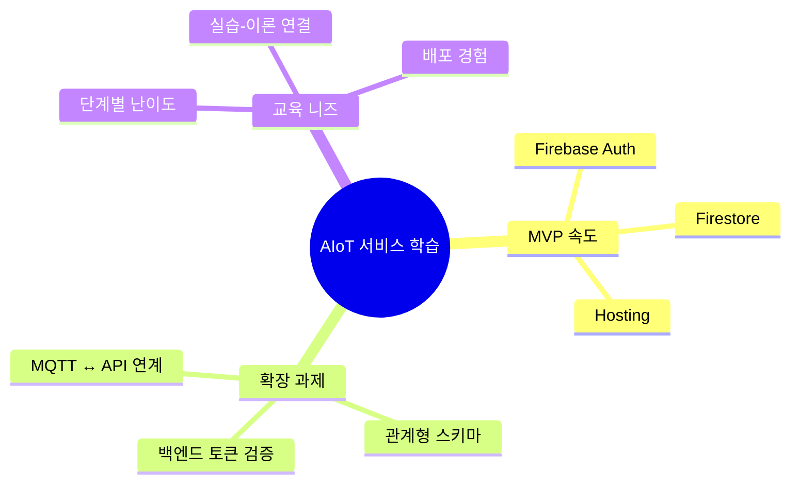
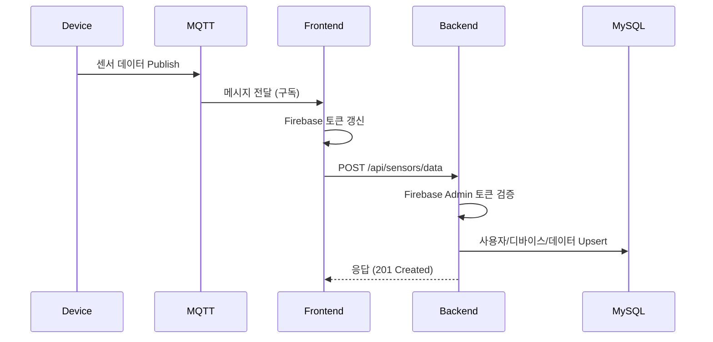
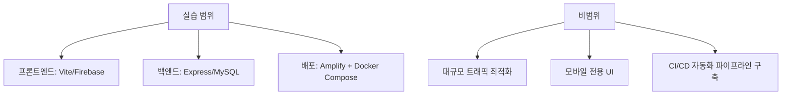

# 1. 문제정의 & 요구사항 명세

## 1.1 문제 배경
- **교육 상황**: 초·중급 개발자가 IoT 서비스 기획에서 배포까지 전 과정을 경험해야 함.
- **현 실태**: Firebase 기반 MVP는 빠르지만, 백엔드 확장 시 인증/데이터 저장 전략을 재학습해야 함.
- **목표**: 단일 실습 레포지토리로 프론트엔드 → 백엔드 연동 → 배포까지 단계별 학습 여정 제공.

## 1.2 이해관계자
| 구분 | 목표 | 요구 |
| --- | --- | --- |
| 교육생 | IoT 서비스 흐름 완성 | 실습 중심 자료, 문제 해결 가이드 |
| 강사 | 체계적 커리큘럼 제공 | 단계별 문서/워크북, 평가 지표 |
| 교육 운영자 | 고품질 사례 확보 | 배포 자동화, 운영 체크리스트 |

## 1.3 사용자 시나리오

## 1.4 기능 요구사항 (Functional Requirements)
| ID | 분류 | 내용 | 우선순위 |
| --- | --- | --- | --- |
| FR-01 | 인증 | Firebase 이메일/Google 로그인을 제공한다 | ★★★ |
| FR-02 | 디바이스 | Firestore 기반 디바이스 CRUD UI를 제공한다 | ★★★ |
| FR-03 | 실시간 | MQTT 메시지를 수신해 차트로 시각화한다 | ★★☆ |
| FR-04 | 연동 | Firebase ID 토큰을 백엔드에 전달해 DB에 저장한다 | ★★★ |
| FR-05 | 설정 | “BE 연동하기” 버튼으로 엔드포인트를 등록한다 | ★★☆ |
| FR-06 | 문서 | API/OpenAPI 및 가이드를 제공한다 | ★★☆ |

## 1.5 비기능 요구사항 (Non-Functional Requirements)
| 영역 | 요구사항 | 기준 |
| --- | --- | --- |
| 성능 | API 응답은 1초 이내 | 로컬 기준 95 percentile |
| 보안 | 모든 요청은 Firebase ID 토큰으로 인증 | Firebase Admin SDK 검증 |
| 확장성 | 데이터 스키마는 Append-Only 설계를 갖는다 | Sensor Readings 테이블 |
| 관측성 | 백엔드 로그는 pino 기반 구조화 | INFO/ERROR 수준 분리 |
| 학습성 | 문서·가이드는 단계별로 제공 | 본 문서 및 8개 가이드 |

## 1.6 성공 지표
- 프론트엔드에서 디바이스 추가 → MQTT 구독 → 백엔드 저장까지 **30분 내 실습 완수**.
- 백엔드 `/api/sensors/data` 호출 성공률 **95% 이상** (샘플 시나리오 기준).
- 배포 단계에서 Firebase 도메인/CORS 설정 오류 **0건 해결 가이드 제공**.

## 1.7 범위 정의

## 1.8 제약 조건
- 교육 시간: 이론 7h + 실습 7h, 총 2일 구성.
- 로컬 개발 환경: Node.js 18 이상, Docker Desktop 필요.
- 네트워크: MQTT 브로커(HiveMQ 등) 접근 가능해야 함.
- 인증 정보: Firebase 서비스 계정 키는 실습 전 사전 배포 금지.
