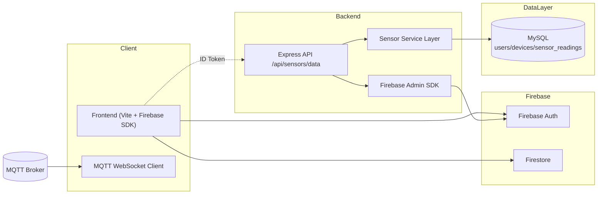
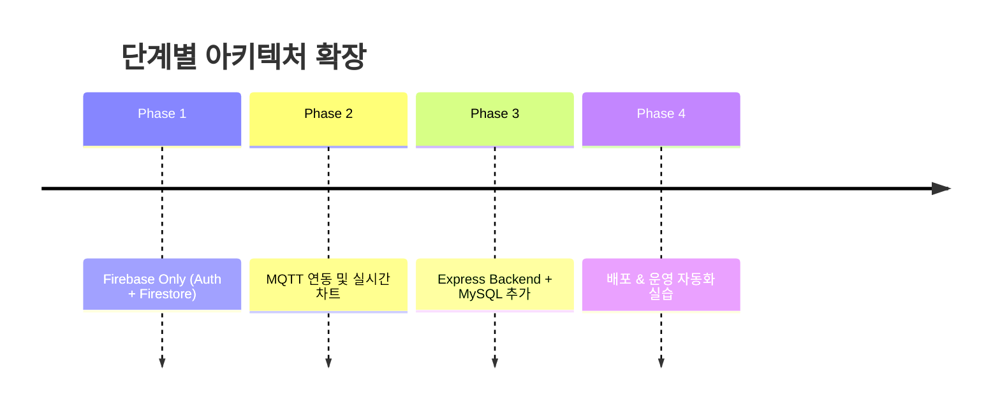
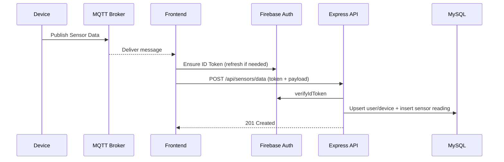
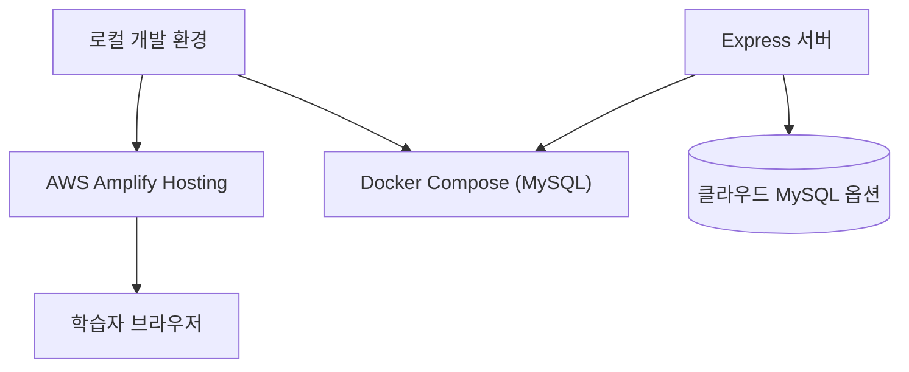

# 2. 아키텍처 개요서

## 2.1 전체 구조 개요

## 2.2 레이어별 역할
| 레이어 | 구성 요소 | 책임 |
| --- | --- | --- |
| Presentation | Vite 기반 SPA, MQTT Manager | 사용자 UI, 실시간 메시지 표시, 설정 UI |
| Integration | Firebase SDK, REST Fetch | 인증, Firestore 실시간 데이터, 백엔드 연동 |
| Application | Express Router, 서비스 로직 | 토큰 검증, 사용자/디바이스 Upsert, 오류 처리 |
| Data | MySQL + Schema | 관계형 저장, Append-only 센서 데이터 로그 |

## 2.3 학습 단계별 아키텍처

## 2.4 데이터 흐름

## 2.5 배포 구조

## 2.6 확장 포인트
- **분석 파이프라인**: Sensor Readings를 기반으로 BI/Analytics 추가 가능.
- **알림 시스템**: 특정 임계값 초과 시 Firebase Cloud Messaging 등으로 확장.
- **CI/CD**: GitHub Actions → Amplify/Container Registry 파이프라인 연결.
- **서버 확장**: Express → NestJS 전환, RDS로 이관 등.
