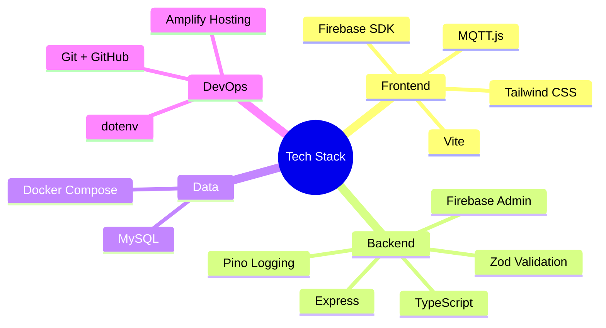
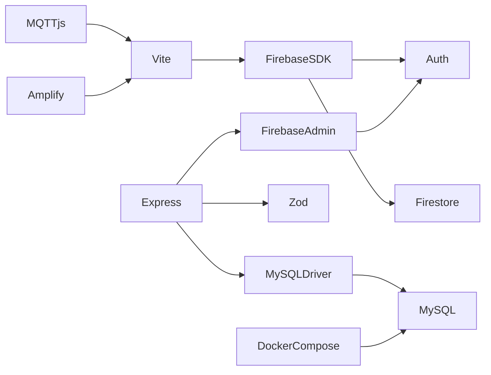
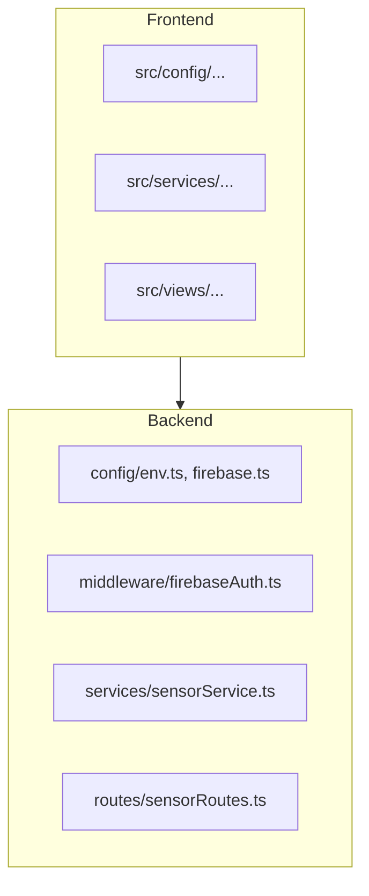

# 3. 기술 스택 설명서

## 3.1 요약 표
| 영역 | 기술 | 버전 (권장) | 선택 이유 |
| --- | --- | --- | --- |
| 프론트엔드 | Vite, Vanilla JS, Tailwind CSS | Node 18+, Tailwind 3+ | 빠른 번들링, 간단한 구성이며 학습 집중 |
| 인증/실시간 | Firebase Auth, Firestore | Web SDK 10+ | 서버리스 MVP, 실시간 동기화 |
| 메시징 | MQTT.js | 최신 | IoT 시나리오 재현, 브라우저 MQTT |
| 백엔드 | Express, TypeScript, Firebase Admin SDK | Node 18+, Admin SDK 12+ | 최소 러닝커브, 확장성 |
| 데이터 | MySQL 8, mysql2 | 8.0+ | 관계형 모델 학습, Docker 사용 용이 |
| 도구 | Docker Compose, Pino, Zod | 최신 | 환경 격리, 구조화 로깅, 입력 검증 |

## 3.2 기술 맵

## 3.3 상호 의존성

## 3.4 선택 대안 비교
| 영역 | 채택 | 대안 | 비교 |
| --- | --- | --- | --- |
| 인증 | Firebase | AWS Cognito | Firebase UI/Docs가 교육 친화적 |
| 백엔드 | Express | NestJS, Fastify | 러닝 커브 대비 빠른 실습 |
| DB | MySQL | PostgreSQL, DynamoDB | SQL 친숙도, Docker 이미지 가용 |
| 배포 | Amplify | Firebase Hosting, Vercel | AWS 기반 과정과의 연계 |
| 메시징 | MQTT.js | Socket.io | IoT 프로토콜 학습 목적 |

## 3.5 패키지 구조 (요약)

## 3.6 향후 업그레이드 제안
- TypeScript 기반 프론트엔드 전환 (React, Vue 등).
- NestJS + TypeORM으로 서비스 계층 정교화.
- AWS IoT Core 등 매니지드 MQTT 브로커 연동.
- Terraform/SAM 등 IaC 도입.
