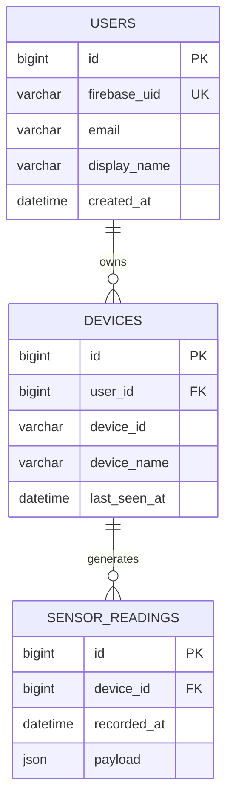
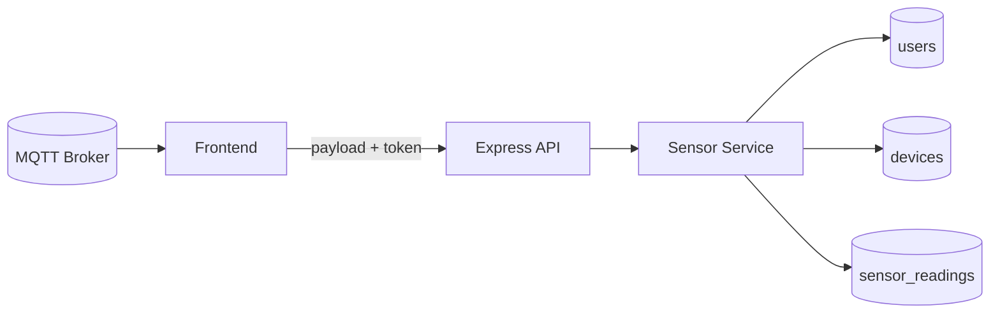

# 4. 데이터 모델 & 스키마 문서

## 4.1 개요
- Firebase Auth UID를 기준으로 MySQL에 사용자-디바이스-센서 데이터 관계를 구성.
- Sensor Readings는 **Append-Only** 구조로 이벤트 소싱 개념을 학습.

## 4.2 엔터티 관계도


## 4.3 Firestore 컬렉션
| 컬렉션 | 필드 | 용도 |
| --- | --- | --- |
| `devices` | name, type, location, status, batteryLevel, userId, createdAt | UI에 즉시 반응, 학습자 CRUD 실습 |
| `users` (선택) | profile, settings | 필요 시 사용자 확장 정보 |

## 4.4 데이터 흐름


## 4.5 스키마 생성 SQL
```sql
CREATE TABLE users (
  id BIGINT UNSIGNED AUTO_INCREMENT PRIMARY KEY,
  firebase_uid VARCHAR(128) NOT NULL UNIQUE,
  email VARCHAR(255),
  display_name VARCHAR(255),
  created_at DATETIME NOT NULL DEFAULT CURRENT_TIMESTAMP
);

CREATE TABLE devices (
  id BIGINT UNSIGNED AUTO_INCREMENT PRIMARY KEY,
  user_id BIGINT UNSIGNED NOT NULL,
  device_id VARCHAR(128) NOT NULL,
  device_name VARCHAR(255),
  last_seen_at DATETIME NOT NULL DEFAULT CURRENT_TIMESTAMP,
  UNIQUE KEY idx_user_device (user_id, device_id),
  FOREIGN KEY (user_id) REFERENCES users(id) ON DELETE CASCADE
);

CREATE TABLE sensor_readings (
  id BIGINT UNSIGNED AUTO_INCREMENT PRIMARY KEY,
  device_id BIGINT UNSIGNED NOT NULL,
  recorded_at DATETIME NOT NULL DEFAULT CURRENT_TIMESTAMP,
  payload JSON NOT NULL,
  KEY idx_device_time (device_id, recorded_at),
  FOREIGN KEY (device_id) REFERENCES devices(id) ON DELETE CASCADE
);
```

## 4.6 샘플 데이터
| 테이블 | 예시 |
| --- | --- |
| users | `(1, 'firebase-uid-123', 'dev@example.com', 'Dev Student')` |
| devices | `(1, 1, 'temp-sensor-01', '온도센서', '2025-01-01 10:00:00')` |
| sensor_readings | `(1, 1, '2025-01-01 10:05:00', '{"temperature":24.5,"unit":"c"}')` |

## 4.7 확장 고려사항
- 센서 데이터 파티셔닝 (recorded_at 기준 월별 테이블).
- payload JSON → 정규 컬럼화(temperature, humidity 등) 후 인덱스.
- Firestore ↔ MySQL 동기화 전략 (Cloud Functions) 추가 연구.
