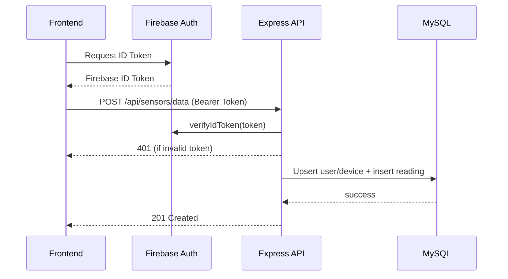

# 5. API 명세서

## 5.1 개요
- 프론트엔드 → 백엔드 통신은 Firebase ID 토큰 기반 Bearer 인증 사용.
- 모든 응답은 JSON 형식, 실패 시 `message`, `details` 필드를 포함.

## 5.2 엔드포인트 요약
| Method | Endpoint | 인증 | 설명 |
| --- | --- | --- | --- |
| GET | `/health` | 불필요 | 헬스 체크, 배포 테스트용 |
| POST | `/api/sensors/data` | Bearer JWT (Firebase ID Token) | 센서 데이터 저장 |

## 5.3 `/health`
```http
GET /health HTTP/1.1
Host: localhost:4000
```
```json
HTTP/1.1 200 OK
{
  "status": "ok"
}
```

## 5.4 `/api/sensors/data`
### 요청
| 필드 | 타입 | 필수 | 설명 |
| --- | --- | --- | --- |
| `deviceId` | string | ✔ | 디바이스 고유 식별자 |
| `deviceName` | string | ❍ | 디바이스 표시 이름 |
| `recordedAt` | ISO8601 string | ❍ | 측정 시각, 미지정 시 서버 시간 |
| `payload` | object | ✔ | 센서 데이터(JSON) |

```http
POST /api/sensors/data HTTP/1.1
Host: localhost:4000
Authorization: Bearer <Firebase-ID-Token>
Content-Type: application/json

{
  "deviceId": "temp-sensor-01",
  "deviceName": "온도센서",
  "recordedAt": "2025-01-01T10:05:00Z",
  "payload": {
    "temperature": 24.5,
    "unit": "celsius"
  }
}
```

### 응답
```json
HTTP/1.1 201 Created
{
  "message": "Sensor reading stored"
}
```

### 오류 응답 예시
```json
HTTP/1.1 400 Bad Request
{
  "message": "Invalid payload",
  "issues": [
    {"path": "deviceId", "message": "String must contain at least 1 character"}
  ]
}
```

## 5.5 흐름 다이어그램


## 5.6 유효성 검증 (Zod 스키마)
```ts
const sensorPayloadSchema = z.object({
  deviceId: z.string().min(1),
  deviceName: z.string().min(1).optional(),
  recordedAt: z.coerce.date().optional(),
  payload: z.record(z.any(), { invalid_type_error: 'payload must be an object' })
});
```

## 5.7 테스트 체크리스트
- 토큰 누락 시 401 반환되는가?
- deviceId 미입력 시 400 오류가 발생하는가?
- payload 내 다양한 센서 데이터를 JSON으로 저장하는가?
- DB에 사용자/디바이스가 없을 경우 자동 생성되는가?
