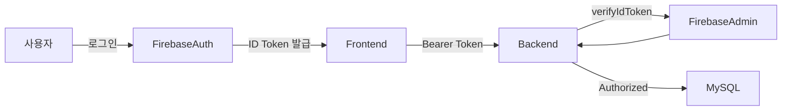
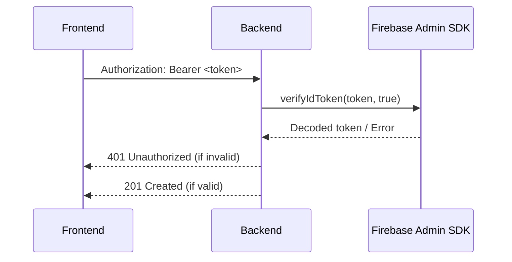

# 6. 보안·인증 가이드

## 6.1 인증 흐름 개요


## 6.2 Firebase Auth 전략
- 로그인 수단: 이메일/패스워드, Google OAuth.
- Authorized Domains: 로컬(5173), Amplify, 커스텀 도메인까지 등록.
- 토큰 갱신: `getIdToken(forceRefresh?)` 사용, 프론트엔드에서 2~10분 자동 캐싱.

## 6.3 백엔드 토큰 검증
```ts
const decoded = await firebaseAuth().verifyIdToken(idToken, true);
req.firebaseUser = {
  uid: decoded.uid,
  email: decoded.email,
  displayName: decoded.name
};
```



## 6.4 환경 변수 관리
| 변수 | 설명 | 주의사항 |
| --- | --- | --- |
| FIREBASE_PROJECT_ID | 서비스 계정 프로젝트 | 프론트/백엔드 일치 |
| FIREBASE_CLIENT_EMAIL | 서비스 계정 이메일 | JSON의 `client_email` |
| FIREBASE_PRIVATE_KEY | 서비스 계정 키 | `\n` 이스케이프 유지 |
| ALLOWED_ORIGINS | CORS 허용 목록 | Firebase Authorized domains와 별개 |

## 6.5 데이터 보호
- Sensor payload는 JSON 전체 저장 → 필요 시 민감 데이터 필터링.
- 사용자 삭제 시 `CASCADE`로 디바이스/데이터 삭제.
- Pino 로그 레벨: 개발에서만 pretty 출력, 운영은 JSON 포맷 유지.

## 6.6 권한 모델
| Actor | 권한 |
| --- | --- |
| 인증 사용자 | 자신의 디바이스/센서 데이터 업로드 |
| 미인증 사용자 | `/health` 조회 가능, 나머지는 401 |
| 백엔드 | ID 토큰 검증 후 사용자 정보를 upsert |

## 6.7 비공개 키 보안
- JSON 키 파일은 `.gitignore` 유지, 클라우드 비밀 관리 서비스 사용 권장.
- 실습용 키는 강의 후 폐기.
- 배포 플랫폼(AWS Amplify) 환경 변수로 주입.

## 6.8 향후 보안 확장
- 데이터 at-rest 암호화 (MySQL Transparent Encryption).
- TLS 기반 MQTT 브로커 사용.
- Firebase Custom Claims로 역할 기반 권한 부여.
