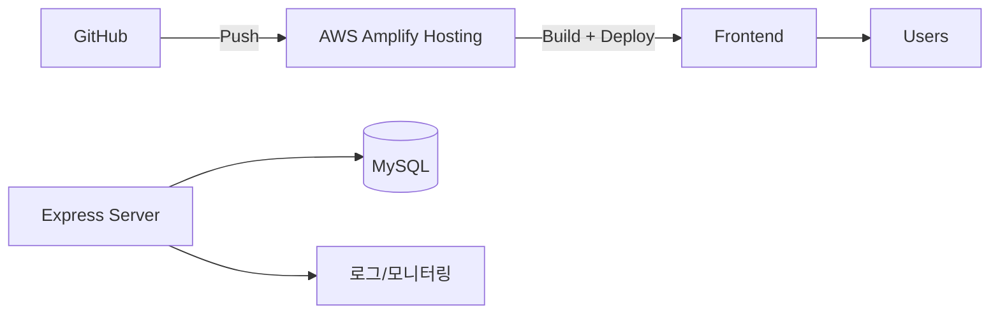
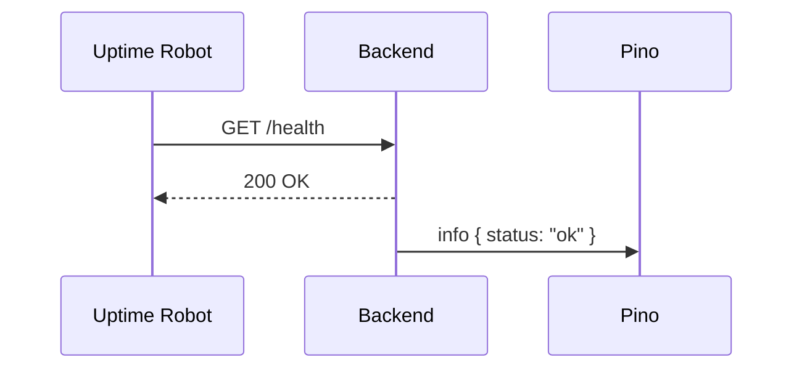
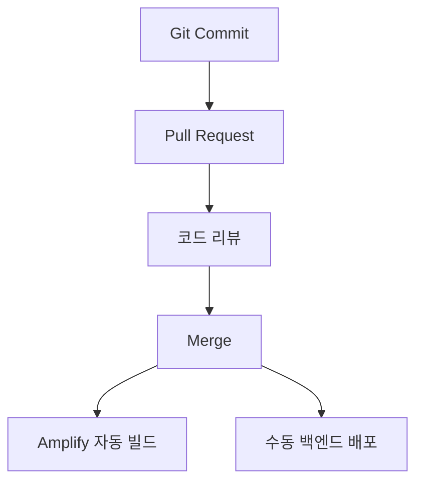

# 8. 배포 & 운영 가이드

## 8.1 배포 전략 개요

## 8.2 프론트엔드 배포 절차 (Amplify)
1. GitHub 저장소 연결.
2. Build Command: `npm install && npm run build`.
3. Output Directory: `aiot-device-manager-fe-working/dist`.
4. 환경 변수: `VITE_*` 값 등록.
5. Amplify 도메인을 Firebase Authorized domains에 추가.

## 8.3 백엔드 운영 옵션
| 방식 | 장점 | 고려사항 |
| --- | --- | --- |
| 로컬 개발 서버 | 설정 단순 | 교육 외 환경에서 접근 어려움 |
| EC2 + PM2 | 지속 실행 가능 | 인프라 관리 필요 |
| AWS Elastic Beanstalk | 배포 자동화 | 비용, 학습 시간 추가 |
| 컨테이너 (ECS/Fargate) | 확장성 | Docker 이미지 관리 |

## 8.4 헬스 체크 & 모니터링

- 프론트: Amplify 콘솔, Lighthouse.
- 백엔드: Pino 로그, `docker logs`, MySQL 상태 확인.

## 8.5 배포 파이프라인 템플릿

## 8.6 실습용 운영 체크리스트
- [ ] Amplify 배포 완료 후 `/health` 엔드포인트 동작 확인.
- [ ] Firebase Authorized domains & Google OAuth Redirect URI 등록.
- [ ] `ALLOWED_ORIGINS`에 배포 도메인 추가.
- [ ] MySQL 백업/복구 절차 문서화.
- [ ] 오류 로그 수집 및 공지 채널 확보(슬랙 등).

## 8.7 로그 정책
| 레벨 | 설명 | 예시 |
| --- | --- | --- |
| INFO | 정상 동작 | `Stored sensor reading` |
| WARN | 토큰 검증 실패 등 | `Failed to verify Firebase token` |
| ERROR | DB 실패, 예외 | `Failed to store sensor reading` |

## 8.8 운영 중 이슈 대응
- 토큰 만료: 프론트에서 강제로 `getIdToken(true)` 호출, 사용자 재로그인 안내.
- DB 연결 끊김: Docker/MySQL 재시작, 커넥션 풀 상태 확인.
- MQTT 지연: 브로커 상태 모니터링, QoS 조정 고려.

## 8.9 향후 자동화 방안
- GitHub Actions + Amplify/EB 배포 스크립트 작성.
- CloudWatch Logs + Alarm 설정.
- Terraform으로 환경 정의.
