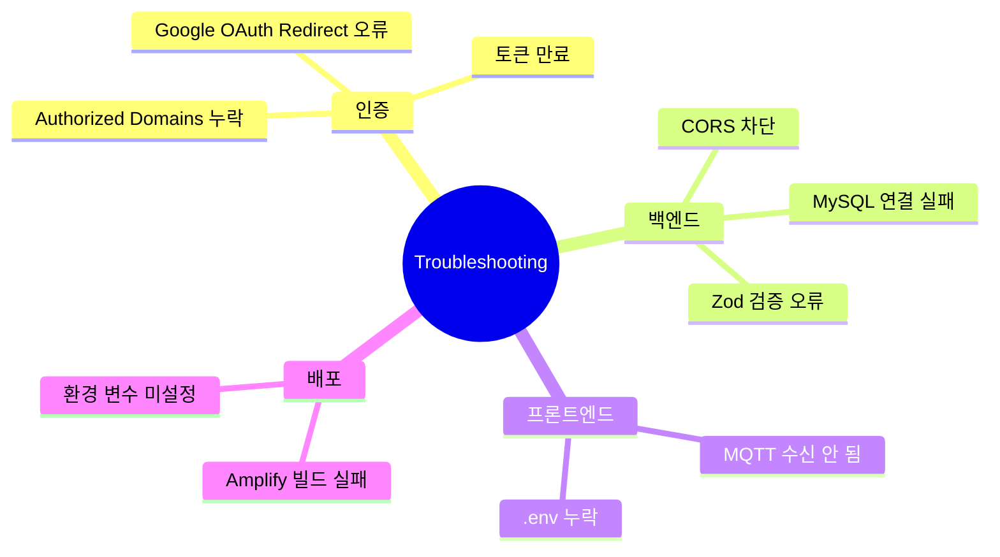
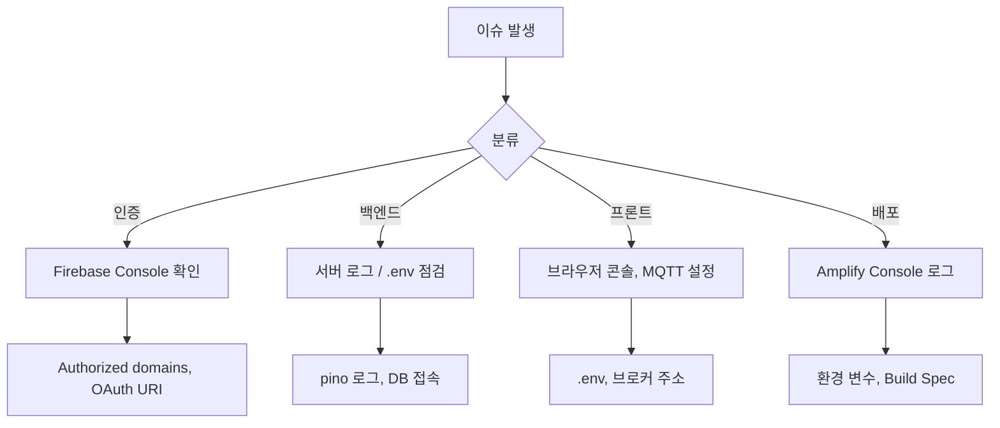

# 9. 문제 해결 시나리오 (FAQ)

## 9.1 분류 맵

## 9.2 FAQ 리스트
| 질문 | 원인 | 해결 방법 |
| --- | --- | --- |
| Firebase 로그인 시 `The requested action is invalid` | Authorized domains 미등록 | Firebase Console → Authentication → Settings에서 도메인 추가 |
| Google 로그인 팝업 후 실패 | Redirect URI 누락 | Google Cloud Console OAuth 클라이언트에 Amplify 도메인 등록 |
| 백엔드 401 Unauthorized | ID 토큰 없음/만료 | 프론트에서 `getIdToken(true)` 호출, 재로그인 유도 |
| `Invalid payload` 400 오류 | 필드 누락/타입 오류 | `deviceId`, `payload` 필수 입력, console 로그로 요청 확인 |
| MQTT 메시지가 수신되지 않음 | 브로커 주소/토픽 오타 | 설정 화면에서 브로커 URL, topicPrefix 재확인 |
| 백엔드 실행 시 `.env` validation 실패 | 환경 변수 누락 | `.env.example`와 비교, Zod 에러 메시지 확인 |
| MySQL 연결 실패 | Docker 미실행, 포트 충돌 | `docker compose ps`, 3306 포트 사용 확인 후 재시작 |
| Amplify 빌드 실패 | Node 버전/환경 변수 미설정 | Amplify Build Settings에 Node 18, VITE_* 변수 지정 |

## 9.3 오류 추적 플로우

## 9.4 로그 해석 예시
| 로그 메시지 | 의미 | 조치 |
| --- | --- | --- |
| `Failed to verify Firebase token` | Bearer 토큰 검증 실패 | 토큰 만료 또는 도메인 미등록 |
| `Invalid payload` | Zod 스키마 유효성 오류 | 필드 타입 확인 |
| `ECONNREFUSED 127.0.0.1:3306` | MySQL 접속 실패 | Docker Compose 상태 확인 |
| `Origin not allowed by CORS` | ALLOWED_ORIGINS 미포함 | `.env` 업데이트 후 서버 재시작 |

## 9.5 지원 채널 샘플 (교육 환경)
- 주강사 슬랙 채널: `#aiot-support`
- 이슈 트래커: GitHub Issues 템플릿 사용
- 사전 제출: `.env` 값, 로그 스니펫, 재현 단계

## 9.6 예방 체크리스트
- [ ] Authorized domains + Google OAuth URI 확인
- [ ] `.env` 값 점검 및 git 미추적 상태 유지
- [ ] Docker Compose 실행 여부 확인
- [ ] MQTT 토픽/브로커 테스트 완료
- [ ] 배포 전 `npm run build` 로컬 검증
